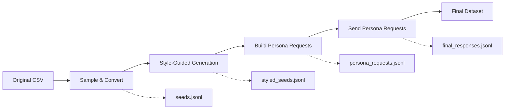

# Arabic-Synth Style-Persona Workflow Guide

## 🎯 Overview

The `style-persona-workflow` command provides a complete end-to-end pipeline that combines style-guided generation with persona augmentation for Arabic exam question synthesis. This unified workflow implements the methodology described in research papers for creating high-quality, diverse synthetic datasets.

## 🔄 Workflow Steps

The command executes a 5-step pipeline:



### Step 1: Sampling & Conversion 📊
- **Input**: Original CSV exam dataset (`test-00000-of-00001.arabic.csv`)
- **Process**: Scientific sampling (uniform or stratified) + CSV-to-JSONL conversion
- **Output**: `seeds.jsonl` - Small set of seed examples for style guidance
- **Purpose**: Create representative samples while maintaining format compatibility

### Step 2: Style-Guided Generation 🎨
- **Input**: `seeds.jsonl` (for style guidance)
- **Process**: LLM generation using seed-based style constraints via `SeedManager`
- **Output**: `styled_seeds.jsonl` - Questions following established style patterns
- **Purpose**: Generate new questions that match the style, complexity, and format of original data

### Step 3: Persona Integration 👥
- **Input**: Pre-existing persona collection (`selected_200.jsonl`)
- **Process**: Verification and preparation of persona data
- **Purpose**: Ensure diverse perspectives are available for augmentation

### Step 4: Build Persona Requests 🔄
- **Input**: `styled_seeds.jsonl` + `selected_persona.jsonl`
- **Process**: Create persona-augmented prompts using the full persona pipeline (`build-persona-requests`)
- **Output**: `persona_requests.jsonl` - Structured requests ready for LLM processing
- **Purpose**: Apply multiple personas to each question for perspective diversity

### Step 5: Send Persona Requests 🚀
- **Input**: `persona_requests.jsonl`
- **Process**: Send requests to LLM using the persona pipeline (`send-persona-requests`)
- **Output**: `final_responses.jsonl` - Complete persona-augmented dataset
- **Purpose**: Generate final synthetic data with persona perspectives applied
- **⚠️ Requirements**: Requires real OpenAI API access (mock model not supported)

## 📋 Command Syntax

```bash
arabic-synth style-persona-workflow [OPTIONS]
```

## 🔧 Parameters

### Required Files
| Parameter | Default | Description |
|-----------|---------|-------------|
| `--input-csv` | `data/test-00000-of-00001.arabic.csv` | Source CSV exam dataset |
| `--personas-path` | `data/personas/selected_200.jsonl` | Pre-selected persona collection |

### Output Configuration
| Parameter | Default | Description |
|-----------|---------|-------------|
| `--output-dir` | `outputs/style_persona` | Directory for all workflow outputs |

### Sampling Configuration
| Parameter | Default | Description |
|-----------|---------|-------------|
| `--n-seeds` | `20` | Number of seed examples to extract |
| `--sampling-mode` | `stratified` | Sampling strategy (`uniform` or `stratified`) |
| `--stratify-col` | `subject` | Column for stratified sampling |

### Generation Configuration
| Parameter | Default | Description |
|-----------|---------|-------------|
| `--n-styled` | `100` | Number of styled questions to generate |
| `--model` | `openai:gpt-4o` | LLM model for generation |

### Persona Configuration
| Parameter | Default | Description |
|-----------|---------|-------------|
| `--per-item-personas` | `5` | Number of personas per styled question |

### Reproducibility
| Parameter | Default | Description |
|-----------|---------|-------------|
| `--seed` | `42` | Random seed for consistent results |

## 🚀 Usage Examples

### Basic Usage (Development)
```bash
# Quick test with cost-effective model
arabic-synth style-persona-workflow \
  --n-seeds 10 \
  --n-styled 50 \
  --model openai:gpt-3.5-turbo \
### Production Run (Small Scale)
```bash
# Production run with OpenAI
arabic-synth style-persona-workflow \
  --n-seeds 20 \
  --n-styled 200 \
  --per-item-personas 10 \
  --model openai:gpt-4o \
  --sampling-mode stratified \
  --output-dir outputs/production_small
```

### Large Scale Production
```bash
# Large-scale dataset generation
arabic-synth style-persona-workflow \
  --n-seeds 50 \
  --n-styled 1000 \
  --per-item-personas 15 \
  --model openai:gpt-4o \
  --sampling-mode stratified \
  --stratify-col subject \
  --output-dir outputs/large_scale \
  --seed 123
```

### Custom Configuration
```bash
# Custom input files and uniform sampling
arabic-synth style-persona-workflow \
  --input-csv data/custom_exams.csv \
  --personas-path data/personas/specialized_personas.jsonl \
  --n-seeds 15 \
  --n-styled 300 \
  --sampling-mode uniform \
  --per-item-personas 8 \
  --model openai:gpt-4-turbo \
  --output-dir outputs/custom_workflow
```

## 📁 Output Structure

The workflow creates a comprehensive output directory:

```
outputs/style_persona/
├── seeds.jsonl                    # Step 1: Sampled seed examples
├── styled_seeds.jsonl             # Step 2: Style-guided questions
├── persona_requests.jsonl         # Step 4: Persona-augmented requests
├── final_responses.jsonl          # Step 5: Final generated dataset
├── error_responses.jsonl          # Step 5: Failed generation attempts (if any)
├── workflow_summary.json          # Complete workflow metadata
└── exams_seeds_audit.json        # Seed usage audit trail
```

### File Descriptions

#### `seeds.jsonl`
```json
{"id": "28a8e962-7722-11ea-9116-54bef70b159e", "question": "في أي أجزاء البلاستيدة الخضراء تحدث التفاعلات المعتمدة على الضوء في عملية البناء الضوئي؟", "options": ["الستروما ) الحشوة (", "الثيلاكويد", "الغشاء الداخلي", "الغشاء الخارجي"], "answer": "الستروما ) الحشوة (", "explanation": ""}
```

#### `styled_seeds.jsonl`
```json
{"question": "ما هي أكبر قارة في العالم من حيث المساحة؟", "options": ["A. آسيا", "B. أفريقيا", "C. أوروبا", "D. أمريكا الشمالية"], "answer": "A"}
```

#### `persona_requests.jsonl`
```json
{"source_id": 0, "persona": "A civic leader who regularly watches the talk-show host's program and provides feedback on their reporting", "prompt": "أنت مساعد خبير في إنشاء أسئلة امتحانية باللغة العربية...", "gen_config": {"temperature": 0.9, "top_p": 0.95}}
```

#### `final_responses.jsonl`
```json
{"persona": "A civic leader who regularly watches the talk-show host's program and provides feedback on their reporting", "source_id": null, "model": "gpt-4o", "synthetic": {"question": "كيف يؤثر الاستخدام المفرط للأسمدة الكيميائية على البيئة من منظور جودة المياه؟", "options": ["A. يسبب تلوثاً في المياه الجوفية", "B. يساهم في تحسين جودة الهواء", "C. يؤدي إلى زيادة في المحاصيل الزراعية", "D. يساعد في تقليل انبعاثات الكربون"], "answer": "A", "rationale": "الاستخدام المفرط للأسمدة الكيميائية يؤدي إلى تسرب العناصر الكيميائية إلى المياه الجوفية، مما يسبب تلوثها."}}
```

#### `workflow_summary.json`
```json
{
  "workflow": "style-persona-combined-full",
  "input_csv": "data/test-00000-of-00001.arabic.csv",
  "sampling_mode": "stratified",
  "n_seeds": 20,
  "n_styled": 100,
  "per_item_personas": 5,
  "model": "openai:gpt-4o",
  "seed": 42,
  "results": {
    "seeds_file": "outputs/style_persona/seeds.jsonl",
    "seeds_count": 20,
    "styled_seeds_file": "outputs/style_persona/styled_seeds.jsonl",
    "styled_count": 100,
    "personas_file": "data/personas/selected_200.jsonl",
    "persona_requests_file": "outputs/style_persona/persona_requests.jsonl",
    "total_requests": 500,
    "final_responses_file": "outputs/style_persona/final_responses.jsonl",
    "total_responses": 500,
    "error_responses_file": "outputs/style_persona/error_responses.jsonl"
  }
}
```

## 🎛️ Advanced Configuration

### Sampling Strategies

#### Stratified Sampling (Recommended)
```bash
--sampling-mode stratified --stratify-col subject
```
- **Use Case**: Balanced representation across subjects
- **Benefits**: Ensures diverse topic coverage in seeds
- **Best For**: General-purpose datasets

#### Uniform Sampling
```bash
--sampling-mode uniform
```
- **Use Case**: Random sampling without constraints
- **Benefits**: Natural distribution preservation
- **Best For**: Maintaining original data distribution

### Model Selection

#### OpenAI Models
```bash
--model openai:gpt-4o          # Latest, most capable
--model openai:gpt-4-turbo     # Fast, high-quality
--model openai:gpt-3.5-turbo   # Cost-effective
```

#### Mock Model (Limited Development)
```bash
--model mock                   # ⚠️ Only works for Steps 1-4, fails at Step 5
```

**Note**: The mock model only supports the initial workflow steps (sampling, style generation, persona request building) but cannot complete Step 5 (sending persona requests) as it requires real OpenAI API integration. For complete workflow testing, use `openai:gpt-3.5-turbo` as a cost-effective alternative.

### Persona Configuration

#### Conservative (High Quality)
```bash
--per-item-personas 3          # 3 personas per question
```

#### Balanced (Recommended)
```bash
--per-item-personas 5-8        # Good diversity/quality balance
```

#### Aggressive (Maximum Diversity)
```bash
--per-item-personas 10-15      # Maximum perspective variety
```

## 📊 Quality Control Features

### Seed Constraints
- **Maximum Seeds**: Limited to ≤10 by default to prevent test set leakage
- **Diversity Check**: Ensures seed variety with minimum diversity threshold
- **Similarity Validation**: Prevents generated content from being too similar to seeds

### Style Guidance
- **Question Length**: Maintains similar word count as seed examples
- **Subject Coverage**: Balances topics based on seed distribution
- **Format Consistency**: Preserves option format and structure
- **Complexity Matching**: Maintains academic difficulty level

### Audit Trail
- **Seed Usage Tracking**: Complete record of which seeds were used
- **Hash Verification**: Cryptographic hashes for reproducibility
- **Constraint Logging**: Documentation of all applied constraints

## 🔍 Troubleshooting

### Common Issues

#### "Loaded 0 seed examples"
```bash
# Problem: Seeds not loading due to format mismatch
# Solution: Check seed file format, ensure required fields exist
head -2 outputs/style_persona/seeds.jsonl
```

#### Repetitive Generated Content
```bash
# Problem: Mock model generating identical questions in Step 2
# Solution: Use real OpenAI model for better variety
--model openai:gpt-4o  # instead of --model mock
```

#### Missing Personas File
```bash
# Problem: Personas file not found
# Solution: Verify personas path or create personas
arabic-synth select-personas --help
```

#### Step 5 Failure with Mock Model
```bash
# Problem: Error "The model `mock` does not exist" in Step 5
# Solution: Mock model doesn't support Step 5 (send-persona-requests)
# Use real OpenAI model instead:
--model openai:gpt-3.5-turbo  # Cost-effective alternative
--model openai:gpt-4o         # Best quality
```

#### Missing OpenAI API Key
```bash
# Problem: API key not found error
# Solution: Set your OpenAI API key
export OPENAI_API_KEY="your-api-key-here"
# Or add to your .env file:
echo "OPENAI_API_KEY=your-api-key-here" >> .env
```

### Validation Commands

#### Check Seeds Format
```bash
# Verify seeds are properly formatted
jq -r '.question' outputs/style_persona/seeds.jsonl | head -3
```

#### Validate Styled Questions
```bash
# Check styled questions variety
jq -r '.question' outputs/style_persona/styled_seeds.jsonl | sort | uniq -c
```

#### Inspect Persona Requests
```bash
# Sample persona requests
jq -r '.persona' outputs/style_persona/combined_requests.jsonl | head -5
```

## 📈 Performance Optimization

### For Large Datasets
```bash
# Optimize for large-scale generation
arabic-synth style-persona-workflow \
  --n-seeds 30 \                    # More seeds for better style guidance
  --n-styled 2000 \                 # Large styled dataset
  --per-item-personas 10 \          # High persona diversity
  --model openai:gpt-4o \           # Most capable model
  --sampling-mode stratified \      # Balanced sampling
  --seed 42                         # Reproducible results
```

### For Development/Testing
```bash
# Quick testing configuration
arabic-synth style-persona-workflow \
  --n-seeds 5 \                     # Minimal seeds
  --n-styled 20 \                   # Small test set
  --per-item-personas 2 \           # Minimal personas
  --model openai:gpt-3.5-turbo \    # Cost-effective for testing
  --output-dir outputs/quick_test
```

## 🔗 Integration with Other Commands

### Pre-workflow Setup
```bash
# 1. Prepare personas (if needed)
arabic-synth select-personas \
  --input-file data/personas/personas_all.jsonl \
  --output-file data/personas/selected_200.jsonl \
  --n 200

# 2. Run style-persona workflow
arabic-synth style-persona-workflow \
  --personas-path data/personas/selected_200.jsonl
```

### Post-workflow Processing
```bash
# The workflow now handles LLM generation automatically!
# But you can still run additional quality checks:

# 3. Quality check final results
arabic-synth evaluate-persona \
  --input-file outputs/style_persona/final_responses.jsonl \
  --output-dir outputs/style_persona/quality_reports

# 4. Clean and post-process (optional)
arabic-synth clean exams \
  --in-path outputs/style_persona/final_responses.jsonl \
  --out-path outputs/style_persona/cleaned_responses.jsonl
```

## 📚 Best Practices

### 🎯 Dataset Design
1. **Start Small**: Begin with `--n-seeds 10 --n-styled 50` for testing
2. **Scale Gradually**: Increase parameters based on quality assessment
3. **Balance Diversity**: Use `--per-item-personas 5-8` for optimal variety
4. **Stratify When Possible**: Use `--sampling-mode stratified` for balanced datasets

### 🔧 Technical Considerations
1. **Reproducibility**: Always set `--seed` for consistent results
2. **Cost Management**: Use `--model openai:gpt-3.5-turbo` for development, `openai:gpt-4o` for production
3. **API Requirements**: Ensure `OPENAI_API_KEY` environment variable is set for real model usage
4. **Quality Control**: Review seed audit files and workflow summaries
5. **Storage Planning**: Large workflows can generate substantial data

### 📊 Quality Assurance
1. **Validate Seeds**: Check that seeds represent desired style and topics
2. **Review Styled Output**: Ensure generated questions show appropriate variety
3. **Inspect Personas**: Verify persona-augmented requests maintain quality
4. **Monitor Constraints**: Check seed constraint compliance in audit files

## 🆘 Support and Documentation

### Related Commands
- `arabic-synth sample-and-convert --help` - Individual sampling and conversion
- `arabic-synth build-persona-requests --help` - Persona request generation
- `arabic-synth evaluate-persona --help` - Persona-augmented quality validation
- `arabic-synth select-personas --help` - Persona curation

### Configuration Files
- `SEED_CONSTRAINTS.md` - Detailed seed constraint documentation
- `StyleGuide_PIPELINE_DETAILED.md` - Style guide methodology
- `Persona_PIPELINE_DETAILED.md` - Persona pipeline details

### Example Workflows
Check the `outputs/` directory for example results from different configurations to understand expected output formats and structures.

### Verified Working Example
```bash
# This configuration has been tested and verified to work:
arabic-synth style-persona-workflow \
  --n-seeds 3 \
  --n-styled 5 \
  --per-item-personas 2 \
  --model openai:gpt-4o \
  --output-dir outputs/test_example \
  --seed 42
```

This example successfully generates:
- 3 seed samples from stratified sampling
- 5 styled questions using seed guidance
- 10 persona-augmented requests (5 × 2 personas)
- 10 final responses with persona perspectives applied

---

**Note**: This workflow combines research-backed methodologies for synthetic data generation with practical tools for Arabic language processing. Always validate results with domain experts and consider ethical implications of synthetic data use.
